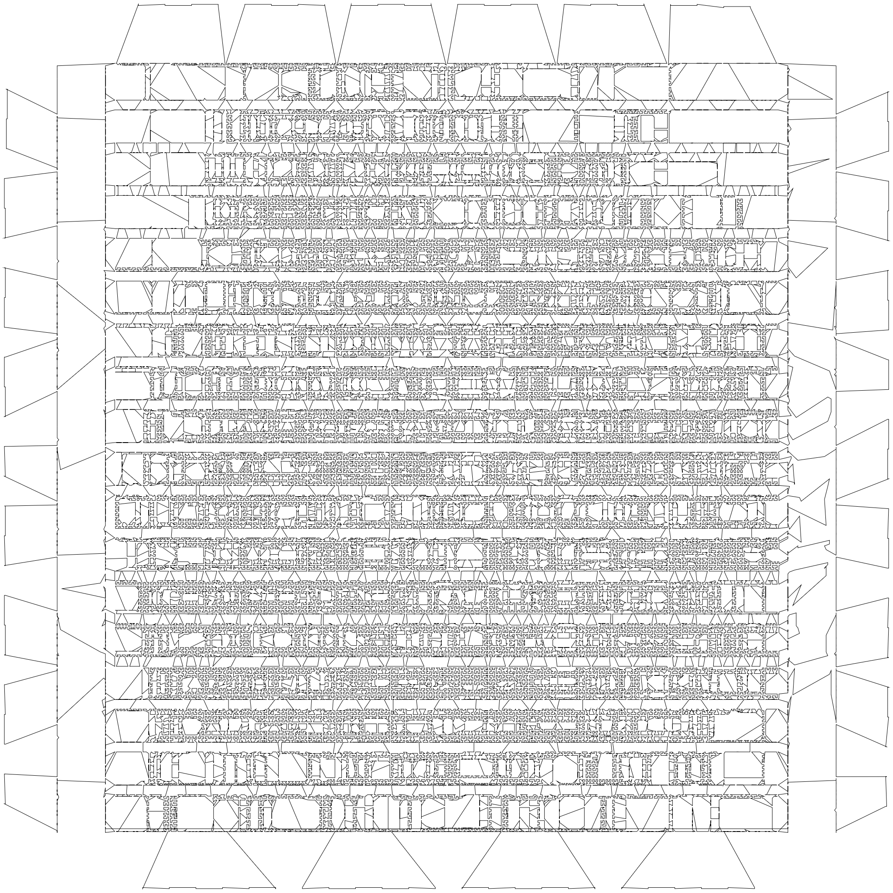

A simple benchmark on how well the [Hilbert Curve Sort](https://github.com/CarbonicSoda/hilbert-curve-sort) performs on the TSPLIB dataset.
Particularly, the famous [pla85900.tsp](pla85900.tsp) set containing 85900 nodes.

The result is quite fascinating to me.
h2CurveSort, a fast algorithm that is not designed for TSP problems,
achieved a distance of $188465250$ (CEIL_2D), only a rough $\times 1.32$ of the Mathematically optimal distance $142382641$ (CEIL_2D).
That might seem quite bad, but many dedicated approximation algorithms do no better, yet this algorithm is more efficient.

The major flaw, is that TSP asks for a _cycle_, not a simple tour.
Hilbert Sort will not minimize the distance between the first and the last node.
This will add an overhead to the resultant distance, which is usually relatively high.

#### Tour Visualization

_Optimal Tour_

_Hilbert Curve Sort Tour_

> The tours' path do not return to the initial node.
